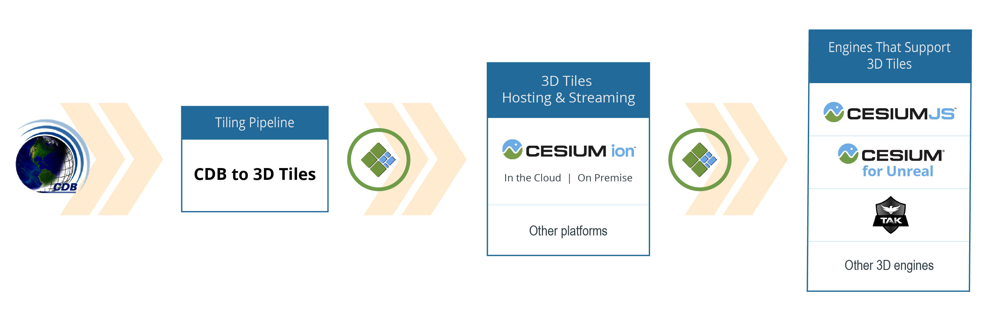
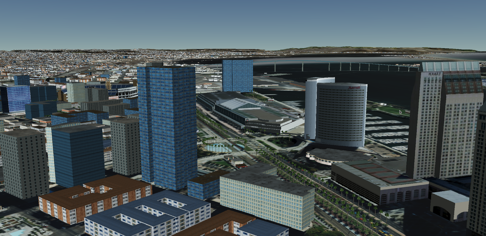
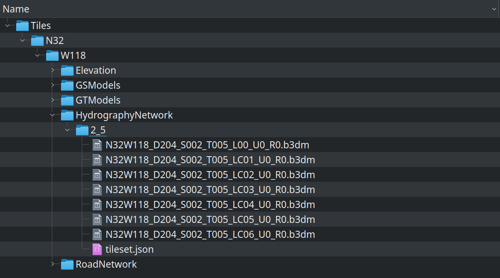
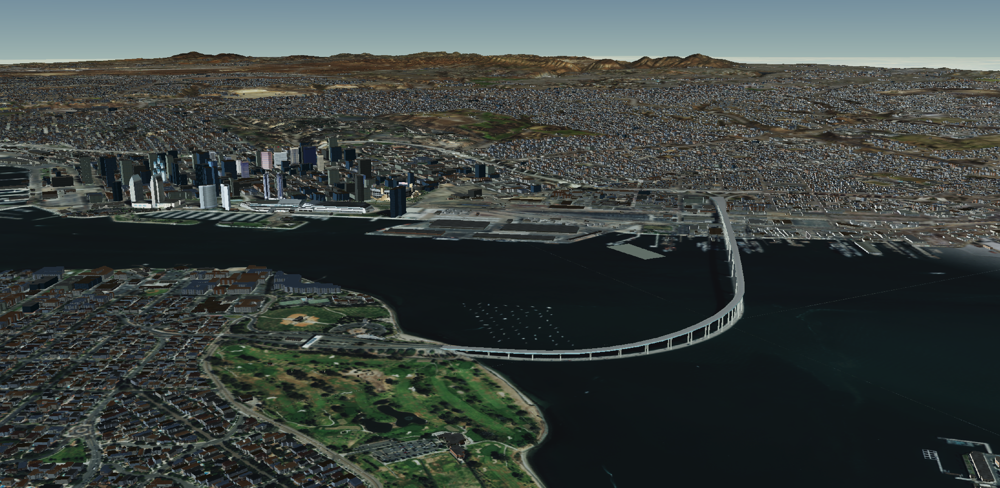
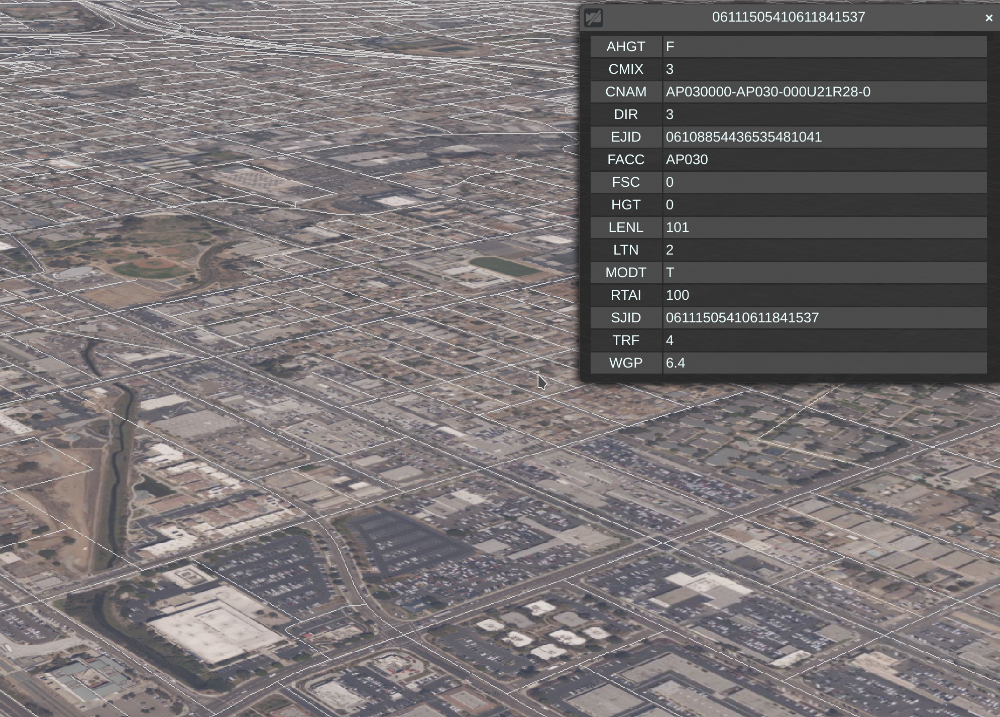

# CDB to 3D Tiles

Convert Open Geospatial Consortium (OGC) CDB datasets to 3D Tiles OGC Community Standard for efficient streaming and rendering across multiple platforms and devices.



Converted tilesets faithfully match the level of detail and precision of the source CDB, with support for most common CDB layers and their associated feature attributes. See [Features](#clipboard-Features) for a full list of supported datasets and [Performance](#checkered_flag-Performance) for performance comparisons.

3D Tiles is designed for efficient runtime visualization and analytics. The pipeline preserves feature attributes from CDB, enabling runtime querying, styling, and analytics to gain deeper insights into the data.



_View of downtown San Diego with terrain, imagery, clamped building models, instanced trees, and Coronado Bridge in the distance, loaded as 3D Tiles in [CesiumJS](https://cesium.com/cesiumjs/). See the live demo [here](https://sandcastle.cesium.com/standalone.html#c=xZZtU+M2EID/iiafkpkgW5ZfuRxTSIBzhoQeMQdH3Q/GVoiILaeyHC50+O+V7byS8HLXKf1i2Vrt7rO70lqKAk55wARok4zmSXcAgjAkWQZECmZpzgFNGQiyjIjMZ9Ua6KYMRmQY5LE4LBd76Zgw8Bn4NTLrjm5PQ3pOu+7lo4v61M1cdmGEbdd0x5Prb+2uA+Wiv6LTsVzkPvaTk1Hv8SbpDRDt3Y9nZ95XvdfpifOr48fzNhrfJCf3vavvP26Sy1n/yqVn7e7kRhrrd75mbhKPIvne874/9L1D1PMOjT5WYWRdJ/3bEzf5/RgfGfSue929tG7sTnCkWpOj7P7idoy+COF18rFf++Qzn00DDqaUPBAuo2DkYZ4N+K2cq/u1sPxup0wElBHu1xpLveOYTANRpGlDtRpwx6Mxkdmr/+0zAHIe74NVFi9IJlMcEjjkaXJYJNmN6sg2DUdtNH32VDipsGAWEkbghNOECjolGQyiqL50vaI5HfTSiMSZhHlNs4B5C/a9uFgzrQIXgKeGz95iXgCuIXvVzBGn0R35WHD9J8A3MLfxPU7IB6fd+Hn6knIF/2UW8fSOB5PRrE/EQ8rHHxsBfn8E26irMC7SIPpf+NV/zz/MWVi2j2yUPuBOVaZ68dEAJc7ylMNiUsZXDJ8KyeIsbQs29uqL4nIzPJM+bTFtg6/TbUvfNLhWrXVLa9O7TAwCFoVBJmJSpNNL0/g24D3C8rKmf1SFm9cPAEF+iH35QxoUhpYZbC5T1gTS3DIRfq25UExZRmISSuUlc72xsgs2yyR4XraCdeGOfA2DONtat56GZwue5jiLcXdYhQEwt/DLEexE+5UQNlPxvgjW/PznAewq1WslmPMXw5/+4g9bne8wSAgP4DCeeWnVMiKSCcqqa8D+RoMJuJBvAcP1PU03NMdE0DQ1jHRdV80m2NMty0EIQWzquoMtQ28CrGtyRNDSdM1EDrbNqsuknBJ5AZk7WeYjopyEr3pWoa46yEC6irCjI0dTpZc9OYt0wzZNhHVsIfk0ylkbabauFQJTtxzdbiwLk09eDk6Fmq1iU7NMbBq2hU1U+XBU3dalIWxZmmabdhOoEGsqth0Lq7aNMdbmHqqtEuV8ESGeX4F8tvPMvbVRXyxwrVlrZWIWk4PC4W80maRcFD2/DqEiSDKJAxmWcpuHYyJgmJX/y5ayUGlFdApo9HnHrRCEsbwrS8kwj+MBfSR+7aClyPUbarGEouzufEp4HMiNX2K0RujgrBJACFuK/CycPtcVVd9bsyujGQkxyfYVJVu1yAoNhmmi3AVxTPhM+Qc)_.

#

### :rocket: Getting Started

See [Getting Started](#getting-started) for installation, build, and usage instructions.

### :green_book: License

[Apache 2.0](http://www.apache.org/licenses/LICENSE-2.0.html). CDB to 3D Tiles is free for both commercial and non-commercial use. See [LICENSE.md](./LICENSE.md) for more details.

The [San Diego CDB](https://gsa-temp-public.s3.us-east-1.amazonaws.com/CDB_san_diego_v4.1.zip) end-user license agreement can be found [here](./Doc/SanDiego_CDB_EULA.pdf).

### :sparkles: Contributions

Pull requests are appreciated.  Please use the same [Contributor License Agreement (CLA)](https://github.com/CesiumGS/cesium/blob/master/CONTRIBUTING.md) used for [CesiumJS](https://cesium.com/cesiumjs/).

### :clipboard: Features

The following CDB features are supported:

#### Feature checklist

Dataset|CDB Name|Supported
--|--|--
Primary Elevation|`001_Elevation`|:heavy_check_mark:
Primary Imagery|`004_Imagery`|:heavy_check_mark:
Road Network|`201_RoadNetwork`|:heavy_check_mark:
Rail Road Network|`202_RailRoadNetwork`|:heavy_check_mark:
Power Line Network|`203_PowerLineNetwork`|:heavy_check_mark:
Hydrography Network|`204_HydrographyNetwork`|:heavy_check_mark:
Geotypical models|`101_GTFeature`, `500_GTModelGeometry`, `501_GTModelTexture`|:heavy_check_mark:
Geospecific models|`100_GSFeature`, `300_GSModelGeometry`, `301_GSModelTexture`|:heavy_check_mark:
Moving models|`600_MModelGeometry`, `601_GSModelTexture`|:x:
Min Max Elevation|`002_MinMaxElevation` `003_MaxCulture`|:x:
Geopolitical Boundaries|`102_GeoPolitical`|:x:
Vector Materials|`200_VectorMaterial`|:x:
Raster Materials|`005_RMTexture`, `006_RMDescriptor`|:x:
Navigation|`400_NavData`, `401_Navigation`|:x:
Bathymetry||:x:
Seasonal Imagery||:x:

#### Additional capabilities

Capability|Supported
--|--
Preserve instance and class attributes for models and vector layers|:heavy_check_mark:
Preserve geometry and texture quality with command line options for controlling mesh decimation|:heavy_check_mark:
Clamp models to the primary elevation dataset|:heavy_check_mark:
Clamp vector layers to the primary elevation dataset|:x:

#### Roadmap

* Windows support
* Performance improvements
* Automatic upload to Cesium ion
* Support more CDB datasets
* Clamp vector layers
* Output 3D Tiles Next (for interoperability with One World Terrain Well-Formed Format)

If you would like to provide feedback or accelerate the product roadmap for features you would like to see included, please contact [Shehzan Mohammed](mailto:shehzan@cesium.com).

#### CDB versions

All versions of CDB are supported. CDB 3.0 and CDB OGC 1.2 (draft) have been tested most during development.

### :checkered_flag: Performance

Performance numbers for [San Diego CDB](https://gsa-temp-public.s3.us-east-1.amazonaws.com/CDB_san_diego_v4.1.zip) measured on a Dell XPS 15 7590

Dataset|Time Elapsed|CDB Size|3D Tiles Size
--|--|--|--
Elevation and Imagery | 38 minutes | 20.3 GB | 17.1 GB
Road Network | 2 seconds | 166.8 MB | 121.3 MB
Hydrography Network | 0.2 seconds | 605 kB | 533.4 kB
GTModel | 0.8 seconds | 221.2 MB | 3.2 MB
GSModel | 9 minutes | 7.6 GB | 1.8 GB
**Total** | **47 minutes** | **28.3 GB** | **19.0 GB**

## Getting Started

### Prerequisites

- Linux (Windows support coming soon)
- C++ compiler that supports C++17 (tested on GCC 9.3.0)
- CMake version 3.15 or higher
- GDAL version 3.0.4 or higher
- OpenGL (needed by OpenSceneGraph)

To install GDAL 3.0.4 on Debian-based systems:

```bash
sudo add-apt-repository ppa:ubuntugis/ppa && sudo apt-get update
sudo apt-get update
sudo apt-get install libgdal-dev
```

To install OpenGL on Debian-based headless systems:

```bash
sudo apt-get install libgl1-mesa-dev
```

### Installing

Clone the repo with:
```
git clone --recurse-submodules git@github.com:CesiumGS/cdb-to-3dtiles.git
```

If `--recurse-submodules` is omitted, run the following command to update submodules:
```
git submodule update --init --recursive
```

### Building

The converter can be built on the command-line with CMake (given that you satisfy all [prerequisites](#prerequisites)):
```
cmake -B Build -S .
cmake --build Build --config Release -j 4
```

The executable can be found in the directory `Build/CLI/CDBConverter`

### Usage

```
Usage:

  CDBConverter [OPTION...]

  -i, --input arg               CDB directory
  -o, --output arg              3D Tiles output directory
      --elevation-normal        Generate elevation normal
      --elevation-lod           Generate elevation and imagery based on
                                elevation LOD only
      --elevation-decimate-error arg
                                Set target error when decimating elevation
                                mesh. Target error is normalized to 0..1 (0.01
                                means the simplifier maintains the error to be
                                below 1% of the mesh extents) (default: 0.01)
      --elevation-threshold-indices arg
                                Set target percent of indices when decimating
                                elevation mesh (default: 0.3)
  -h, --help                    Print usage
```

### Example

The following command converts [San Diego CDB](https://gsa-temp-public.s3.us-east-1.amazonaws.com/CDB_san_diego_v4.1.zip) to 3D Tiles:
```
./Build/CLI/CDBConverter -i CDB_san_diego_v4.1 -o San_Diego
```

### Unit Tests

To run unit tests, run the following command:

```
./Build/Tests/Tests
```

### Docker

You can use Docker to simplify setting up the environment for building and testing. You must install [Docker Engine CE For Ubuntu](https://docs.docker.com/install/linux/docker-ce/ubuntu/) to do so.

The converter can be built with:

```bash
./Docker/build-container.sh
./Docker/build-cdb-to-3dtiles.sh
```

The executable can be found in the directory `Build/CLI/CDBConverter`

Run units tests with the following command:
```
./Docker/run-tests.sh
```

### 3D Tiles Structure

The converter generates multiple 3D Tilesets from the input CDB:

- Primary Elevation and Primary Imagery are combined into a single tileset
- Geotypical models are combined into a single tileset
- Geospecific models are combined into a single tileset
- Vector datasets are written as separate tilesets:
    - Road Network
    - Rail Road Network
    - Power Line Network
    - Hydrography Network

The generated tilesets will be placed in a GeoCell directory similar to how the CDB is organized. For example, the generated tilesets for San Diego will be placed in the `San_Diego/Tiles/N32/W118` directory.

A CDB tile can store different geometries depending on its component selectors. For example, a Hydrography Network tile can have lineal and polygon features within the same tile, which are differentiated by their second respective component selector in the file name. For this reason, a `tileset.json` will be placed in the directory name that make up of the two component selectors, `{Component Selector 1}_{Component Selector 2}`. For example:
- The lineal tileset of the Hydrography Network dataset will be placed in `HydrographyNetwork/2_3` directory 
- The polygon tileset of the Hydrography Network dataset will be placed in `HydrographyNetwork/2_5` directory

Below is the output directory of the converted San Diego 3D Tiles:

<p>
&nbsp;
<br/>
</p>

## Releases

We release as often as needed. CDB To 3D Tiles strictly follows [semver](https://semver.org/).

- Update the project version number in [CMakeLists.txt](./CMakeLists.txt)
- Proofread [CHANGES.md](./CHANGES.md) and make any required updates
- Make sure all unit tests pass
- Commit and push the above changes to `master`
- Create a git tag for the version and push it:
  - `git tag -a 0.1.0 -m "0.1.0 release"`
  - `git push origin 0.1.0`

## Featured Demo

[Live Demo](https://sandcastle.cesium.com/standalone.html#c=xZZtU+M2EID/iiafkpkgW5ZfuRxTSIBzhoQeMQdH3Q/GVoiILaeyHC50+O+V7byS8HLXKf1i2Vrt7rO70lqKAk55wARok4zmSXcAgjAkWQZECmZpzgFNGQiyjIjMZ9Ua6KYMRmQY5LE4LBd76Zgw8Bn4NTLrjm5PQ3pOu+7lo4v61M1cdmGEbdd0x5Prb+2uA+Wiv6LTsVzkPvaTk1Hv8SbpDRDt3Y9nZ95XvdfpifOr48fzNhrfJCf3vavvP26Sy1n/yqVn7e7kRhrrd75mbhKPIvne874/9L1D1PMOjT5WYWRdJ/3bEzf5/RgfGfSue929tG7sTnCkWpOj7P7idoy+COF18rFf++Qzn00DDqaUPBAuo2DkYZ4N+K2cq/u1sPxup0wElBHu1xpLveOYTANRpGlDtRpwx6Mxkdmr/+0zAHIe74NVFi9IJlMcEjjkaXJYJNmN6sg2DUdtNH32VDipsGAWEkbghNOECjolGQyiqL50vaI5HfTSiMSZhHlNs4B5C/a9uFgzrQIXgKeGz95iXgCuIXvVzBGn0R35WHD9J8A3MLfxPU7IB6fd+Hn6knIF/2UW8fSOB5PRrE/EQ8rHHxsBfn8E26irMC7SIPpf+NV/zz/MWVi2j2yUPuBOVaZ68dEAJc7ylMNiUsZXDJ8KyeIsbQs29uqL4nIzPJM+bTFtg6/TbUvfNLhWrXVLa9O7TAwCFoVBJmJSpNNL0/g24D3C8rKmf1SFm9cPAEF+iH35QxoUhpYZbC5T1gTS3DIRfq25UExZRmISSuUlc72xsgs2yyR4XraCdeGOfA2DONtat56GZwue5jiLcXdYhQEwt/DLEexE+5UQNlPxvgjW/PznAewq1WslmPMXw5/+4g9bne8wSAgP4DCeeWnVMiKSCcqqa8D+RoMJuJBvAcP1PU03NMdE0DQ1jHRdV80m2NMty0EIQWzquoMtQ28CrGtyRNDSdM1EDrbNqsuknBJ5AZk7WeYjopyEr3pWoa46yEC6irCjI0dTpZc9OYt0wzZNhHVsIfk0ylkbabauFQJTtxzdbiwLk09eDk6Fmq1iU7NMbBq2hU1U+XBU3dalIWxZmmabdhOoEGsqth0Lq7aNMdbmHqqtEuV8ESGeX4F8tvPMvbVRXyxwrVlrZWIWk4PC4W80maRcFD2/DqEiSDKJAxmWcpuHYyJgmJX/y5ayUGlFdApo9HnHrRCEsbwrS8kwj+MBfSR+7aClyPUbarGEouzufEp4HMiNX2K0RujgrBJACFuK/CycPtcVVd9bsyujGQkxyfYVJVu1yAoNhmmi3AVxTPhM+Qc) of San Diego terrain, imagery, and models. Click individual models or vector features to see their metadata.



